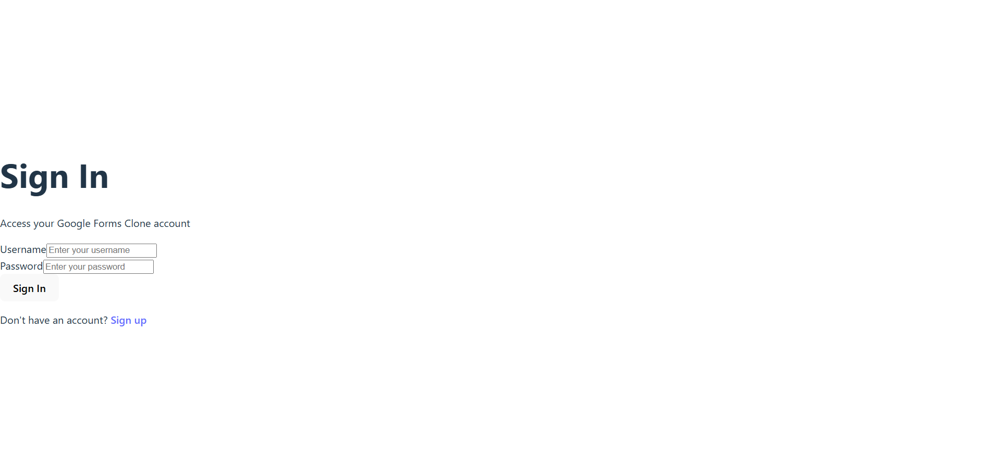
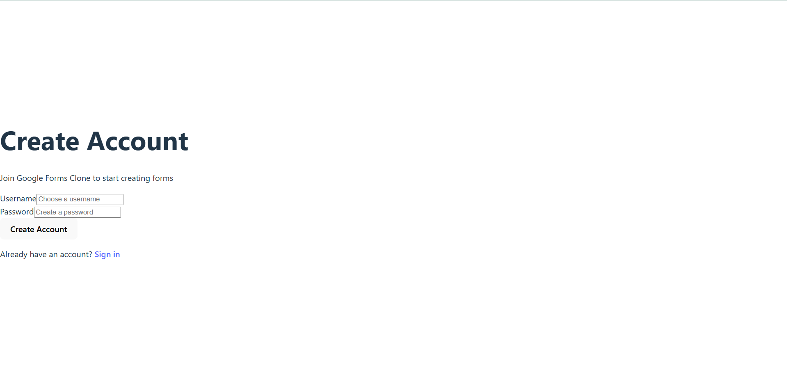
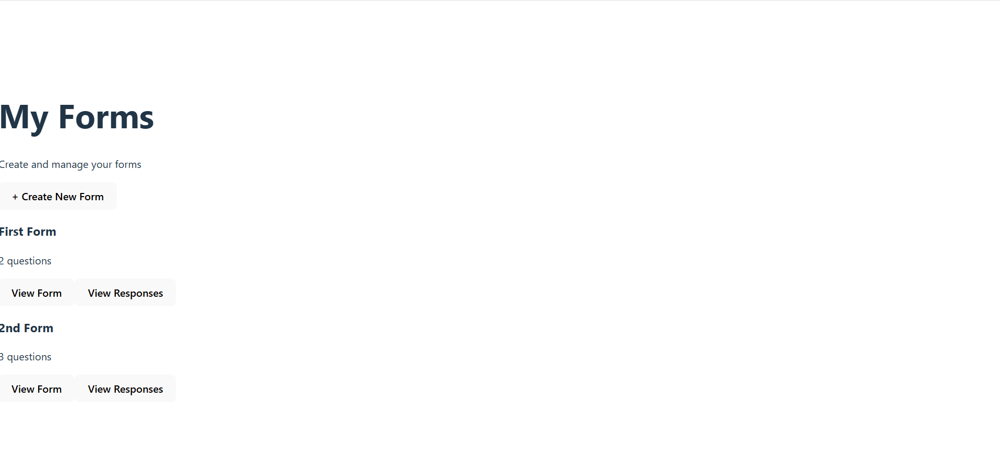
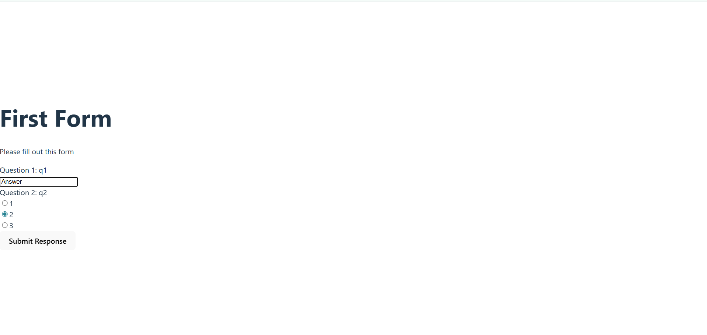
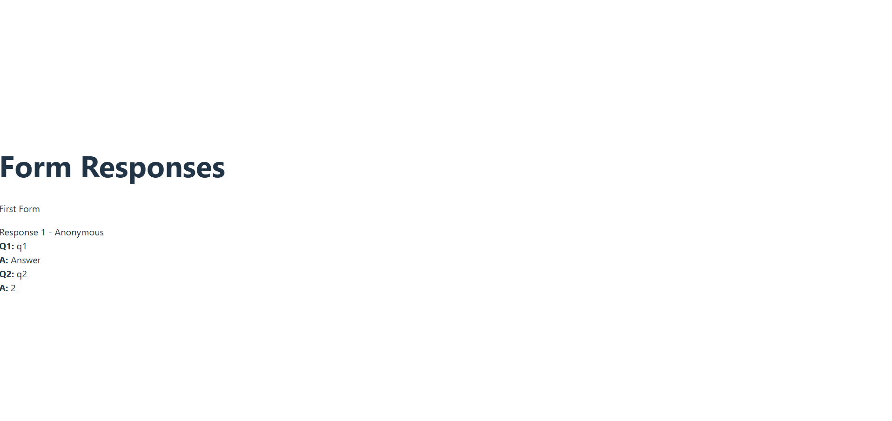

# Google Forms Clone

A full-stack web application that simulates Google Forms functionality, built with **Node.js** and **React.js**. This project allows users to create dynamic forms, collect responses, and manage form data with a clean, modern interface.

## Features

### Core Functionality

- **User Authentication**: Secure signup and login system
- **Form Creation**: Build forms with multiple question types
- **Dynamic Questions**: Support for text and multiple-choice questions
- **Response Collection**: Submit and view form responses
- **Form Management**: List and manage created forms

## Tech Stack

### Backend

- **Node.js** - Runtime environment
- **Express.js** - Web framework
- **MongoDB** - Database
- **Mongoose** - ODM for MongoDB
- **bcryptjs** - Password hashing
- **CORS** - Cross-origin resource sharing

### Frontend

- **React.js** - UI library
- **React Router** - Client-side routing
- **Axios** - HTTP client
- **Vite** - Build tool and dev server
- **CSS3** - Styling with Google Forms-inspired design

## 📁 Project Structure

```
Google-Forms/
├── 📁 backend/                 # Backend server
│   ├── 📁 controllers/         # Request handlers
│   │   ├── authController.js   # Authentication logic
│   │   └── formController.js   # Form management logic
│   ├── 📁 models/              # Database models
│   │   ├── User.js            # User schema
│   │   ├── Form.js            # Form schema
│   │   └── Response.js        # Response schema
│   ├── 📁 routes/              # API routes
│   │   ├── authRoutes.js      # Authentication endpoints
│   │   └── formRoutes.js      # Form endpoints
│   ├── 📁 middlewares/         # Custom middleware
│   │   └── authMiddleware.js  # Authentication middleware
│   ├── 📁 lib/                 # Utilities
│   │   └── db.js              # Database connection
│   └── server.js              # Main server file
├── 📁 frontend/                # React application
│   ├── 📁 src/
│   │   ├── 📁 pages/          # React components
│   │   │   ├── Login.jsx      # Login page
│   │   │   ├── Signup.jsx     # Signup page
│   │   │   ├── Dashboard.jsx  # Main dashboard
│   │   │   ├── CreateForm.jsx # Form creation
│   │   │   ├── ViewForm.jsx   # Form viewing/submission
│   │   │   └── ViewResponses.jsx # Response viewing
│   │   ├── App.jsx            # Main app component
│   │   ├── App.css            # Global styles
│   │   └── main.jsx           # App entry point
│   └── package.json           # Frontend dependencies
├── 📁 screenshots/             # Application screenshots
├── 📁 docs/                    # API documentation
└── README.md                   # Project documentation
```

## Screenshots

### Authentication


_Clean and centered login interface with Google Forms-inspired design_


_User registration with modern form styling_

### Dashboard & Forms


_Main dashboard showing created forms with action buttons_


_Form viewing and response submission interface_


_Response management and viewing system_

## Getting Started

### Prerequisites

- **Node.js** (v14 or higher)
- **MongoDB** (local installation or MongoDB Atlas)
- **npm** or **yarn** package manager

### Installation

1. **Clone the repository**

   ```bash
   git clone https://github.com/yourusername/Google-Forms.git
   cd Google-Forms
   ```

2. **Setup Backend**

   ```bash
   cd backend
   npm install
   ```

3. **Configure Environment Variables**
   Create a `.env` file in the backend directory:

   ```env
   MONGO_URI=your_mongodb_connection_string
   PORT=3001
   ```

4. **Setup Frontend**
   ```bash
   cd ../frontend
   npm install
   ```

### Running the Application

1. **Start Backend Server**

   ```bash
   cd backend
   npm run dev
   ```

   Server will run on `http://localhost:3001`

2. **Start Frontend Development Server**

   ```bash
   cd frontend
   npm run dev
   ```

   Application will run on `http://localhost:5173`

3. **Access the Application**
   Open your browser and navigate to `http://localhost:5173`

## API Documentation

The project includes comprehensive API documentation in OpenAPI/Swagger format. You can find the API specification in the `docs/` folder.

### Key Endpoints

- `POST /api/auth/signup` - User registration
- `POST /api/auth/login` - User authentication
- `GET /api/forms` - List user's forms
- `POST /api/forms` - Create new form
- `GET /api/forms/:id` - Get specific form
- `POST /api/forms/:id/response` - Submit form response
- `GET /api/forms/:id/responses` - View form responses


## License

This project is licensed under the MIT License - see the [LICENSE](LICENSE) file for details.